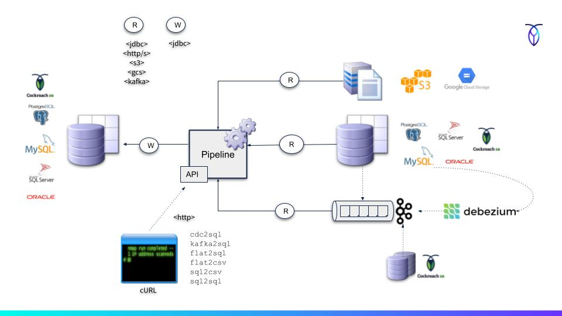

# Pipeline

Pipeline is a minimalistic data migration tool for CockroachDB based on
[Spring Batch 5.x](https://spring.io/projects/spring-batch#overview). 
It can be used to both ingest and extract data at table level 
between different CockroachDB clusters or other databases or 
cloud storage services. 

# How it works

Pipeline operates at table level, meaning that you can copy a table and 
keep all its contents in sync between different databases. Its done by 
submitting independent one-off batch jobs for each table (or file) to 
be "copied" from a source to a target sink.    

One option is to use the Change Data Capture (CDC) feature of CockroachDB 
through either the Kafka or Webhook sink. Another option is passing a 
series of pagination queries against a source database of choice including 
PostgreSQL, Oracle, MySQL, SQL Server and also CockroachDB, and then 
stream the result straight to a target database using batch 
INSERTs or UPSERTs. 

It supports also the mapping of flatfiles into CSVs and then streaming a 
CSV feed into the `IMPORT INTO` command of CockroachDB.   

Conceptual diagram of different read and write flows:
                                

The concept can be expressed using the following pseudo-grammar:

    <IN> <PROTOCOL> <PIPE> <PROTOCOL> <OUT>
    <IN> ::= <CSV> <Fixed-width> <SQL Query> <Change Feed>
        <CSV> ::= a delimited text file
        <Fixed-width> ::= a fixed-width text file
        <SQL Query> ::= results of a SQL query
        <Change Feed> ::= <Webhook> <Kafka>
            <Webook> ::= stream of CDC events from CockroachDBs webhook sink
            <Kafka> ::= stream of CDC events from CockroachDBs Kafka sink or Debezium 
    <PROTOCOL>: FILE|S3|JDBC|HTTP|KAFKA
        <FILE> ::= Read CSV/flat file from local file system
        <S3> ::= Read CSV/flat file from S3 bucket
        <JDBC> ::= Read or write to database
        <HTTP> ::= Receive CDC HTTP (webhook) change feed events from CockroachDB
        <KAFKA> ::= Receive CDC Kafka change feed events from CockroachDB or Debezium
    <PIPE>: Pipeline Server
    <OUT>: <CSV> <SQL>
            <CSV> ::= a delimited text file intended for IMPORT INTO
            <SQL> ::= a SQL INSERT or UPSERT

In summary, these are a few pipeline options:
                                                   
    flat-file ->(read)-> PIPE <-(read)<- CRDB IMPORT INTO
    flat-file ->(read)-> PIPE ->(write)-> SQL INSERTs/UPSERTs
    Paginated SQL query ->(read)-> PIPE <-(read)<- CRDB IMPORT INTO
    Paginated SQL query ->(read)-> PIPE ->(write)-> SQL INSERTs/UPSERTs
    CRDB CDC HTTP sink ->(write)-> PIPE ->(write)-> SQL INSERTs/UPSERTs
    CRDB CDC Kafka sink ->(write)-> Kafka ->(write)-> PIPE ->(write)-> SQL INSERTs/UPSERTs
    Debezium ->(write)-> Kafka ->(write)-> PIPE ->(write)-> SQL INSERTs/UPSERTs

Pipeline is based on Spring Boot 3.x and [Spring Batch 5.x](https://spring.io/projects/spring-batch#overview)
which is a lightweight batch processing framework for creating complex, high-volume batch jobs in a
scalable manner. Spring Batch provides support for many database pagination query dialects.

# Building and Installing

The project is packaged as a single executable JAR file and runs on any platform for which there is a 
Java 17+ runtime. 

## Prerequisites

- Java 17 
  - https://openjdk.org/projects/jdk/17/
  - https://www.oracle.com/java/technologies/downloads/#java17 
- Maven 3+ (optional, embedded wrapper available)
  - https://maven.apache.org/ 

Install the JDK (Ubuntu example):

    sudo apt-get install openjdk-17-jdk

Confirm the installation by running:

    java --version

## Clone the project

    git clone git@github.com:cloudneutral/roach-pipeline.git pipeline

## Build the executable jar

    cd pipeline
    chmod +x mvnw
    ./mvnw clean install

The executable jar is now found at `target/pipeline.jar`.

# Running 

Pipeline provides both a built-in command line shell and a [REST API](docs/api/README.md). 
The shell is optional and mainly intended for inspecting and 
restarting jobs if necessary.

The REST API is the main interface, intended for submitting jobs 
using pre-filled forms with DML and query statements. The REST API 
is also used by CockroachDB's `IMPORT INTO` command when Pipeline 
is operating as a proxy and for the CockroachDB CDC webhook sink. 

Jobs can be submitted with [cURL](https://en.wikipedia.org/wiki/CURL), 
[Postman](https://www.postman.com/downloads/) or a custom HTTP client.

Pipeline stores job metadata in a database. The choice of database is
either H2 (in-memory) or CockroachDB. The default is CockroachDB unless
changed to H2 via profile activation (see below).

## Using CockroachDB for metadata

First create the database that will store job metadata and stats:

    cockroach sql --insecure --host=localhost -e "CREATE database pipeline"

Then start the server with default profiles:

    java -jar target/pipeline.jar

## Using H2 for metadata

To use in-memory H2 instead, execute the following command:

    java -jar target/pipeline.jar h2

This will start the server with the embedded in-memory H2 database. 
Notice that it's an ephemeral mode where all job metadata and the ability 
to restart jobs will be lost after process termination.

## Usage 

Type `help` in the shell for command guidance.

The REST API endpoints are by default rooted at:

    http://localhost:8090
    https://localhost:8443
 
Test the service with:

    curl 'http://localhost:8090' -i -X GET
    curl 'https://localhost:8443' -i -X GET --insecure

For further usage tutorials and examples, see:

- [Sample](docs/samples/README.md) commands for different pipeline jobs
- [Tutorials](docs/tutorials/README.md) for building different data pipelines

## Additional Documentation

- [Schema](docs/etc/schema.md) definition for mapping CSV and flat-files
- [REST API](docs/api/README.md) guide for programmatic interaction

## Install as Unix/Linux Service

Pipeline is a self-contained Spring Boot app that is easy to deploy as a service.
Here's an [example](https://docs.spring.io/spring-boot/docs/current/reference/htmlsingle/#deployment.installing.nix-services)
of starting a Unix/Linux service via `init.d` or `system.d`.

## Configuration

All parameters in [application.yml](src/main/resources/application.yml) can be overridden through
startup parameters. See [Common Application Properties](http://docs.spring.io/spring-boot/docs/current/reference/html/common-application-properties.html)
for more details.

For example using a custom HTTP listen port and database URL for job metadata (internal):

    java -jar pipeline.jar \
    --server.port=8443 \
    --server.http.port=8888 \
    --spring.datasource.url=jdbc:postgresql://192.168.1.2:26257/pipeline?sslmode=disable 

To disable the shell, use:

    java -jar pipeline.jar --disable-shell 

## Supported Databases

- CockroachDB
- PostgreSQL
- H2
- MySQL *
- SQLServer *
- Oracle *

*) Enable the `jdbc-driver-bundle` maven profile to bundle all JDBC drivers:

    ./mvnw -P jdbc-driver-bundle clean install
 
# Terms of Use

See [MIT](LICENSE.txt) for terms and conditions.
