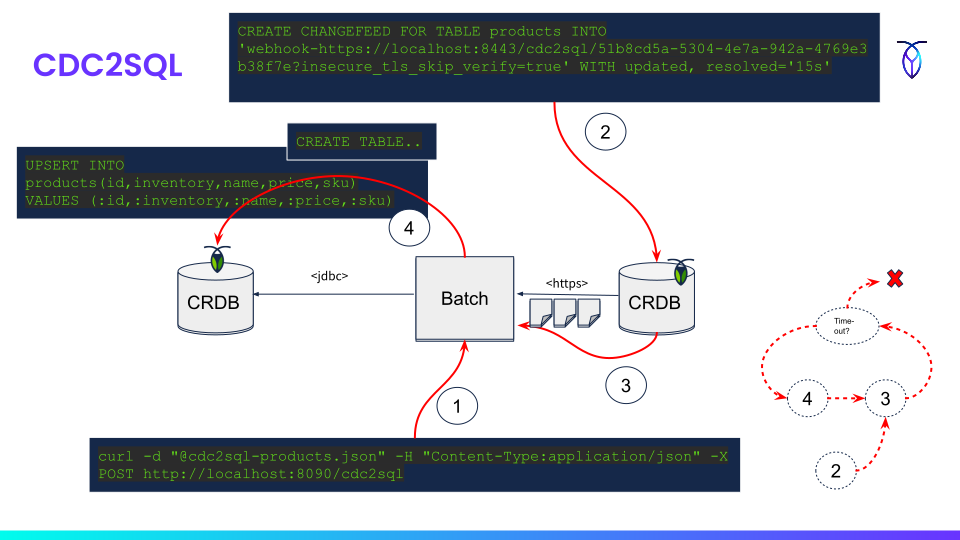

# cdc2sql Resource

This resource represents an HTTP changefeed to SQL pipeline job that will receive
change events and execute `UPSERT` statements based on the payload.

## Retrieve Form

A `GET` request will provide a form template for creating a job instance. 

This form can optionally be pre-filled with SQL clauses and `UPSERT` statements
based on a source database introspection. To enable form template pre-fills, pass
in a `table` request parameter with the table name. See this
[guide](../forms.md) for more details.

### Response Structure

| Path               | Type   | Description                                                                                        |
|--------------------|--------|----------------------------------------------------------------------------------------------------|
| _template.default  | Object | Form properties                                                                                    |
| _links             | Object | Links to related resources                                                                         |
| targetUrl          | String | 1)                                                                                                 |
| targetUsername     | String | 1)                                                                                                 |
| targetPassword     | String | 1)                                                                                                 |
| concurrency        | Number | Number of concurrent processors 2)                                                                 |
| subscriberId       | String | Used to hook the job instance together with the CDC changefeed (doesnt need to be a UUID)          | 
| chunkSize          | Number | The commit interval that defines the number of CDC `payload` items read at minimum before writing. |
| pollTimeoutSeconds | Number | Polling timeout in seconds when job is completed.                                                  |
| createQuery        | String | 1)                                                                                                 | 
| insertQuery        | String | 1)                                                                                                 | 

1) See `_template.default` properties for a description. This field
can be pre-populated from template settings or by database introspection.

2) A value higher than 1 enables parallel processing of payload items within 
the change events. The result is that the reading, processing, and writing of 
each chunk of items (each commit interval) is done in a separate thread of execution. 
Note that this means there is no fixed order for the items to be processed, 
and a chunk might contain items that are non-consecutive compared to the 
single-threaded case. 

### Remarks
  
The payload events inside the change events are queued up internally without any 
durability guarantees. It means that change events that have been ACK:ed with the 
source publisher can still be in-flight to the target database. 

If you need strict durability guarantees, either set queue capacity to one
(with performance implications) or use the Kafka sink and the kafka2sql job.
The queue size is configurable with the `--pipeline.cdc.webhook.queue-capacity` 
startup parameter.

### Links

| Path                 | Description              |
|----------------------|--------------------------|
| self                 | The cdc2sql resource     |
| curies               | Curies for documentation |

### Example request

    curl --insecure -X GET https://localhost:8443/cdc2sql/form?table=product > cdc2sql.json

### Example response

See [cdc2sql-req.json](cdc2sql-req.json)

## Create a job

A `POST` request will submit a job request.

### Example request

    curl https://localhost:8080/cdc2sql --insecure -i -X POST \
    -d '{
    "targetUrl" : "jdbc:postgresql://192.168.1.99:26300/tpcc_copy?sslmode=disable",
    "targetUsername" : "root",
    "targetPassword" : "",
    "concurrency" : 1,
    "subscriberId" : "193bf3dc-12d5-4cb8-a386-6733769cd981",
    "chunkSize" : 32,
    "pollTimeoutSeconds" : 25,
    "createQuery" : "CREATE TABLE IF NOT EXISTS products(id uuid not null default gen_random_uuid(), inventory int not null, name varchar(128) not null, price numeric(19, 2) not null, sku varchar(128) not null unique, primary key (id))",
    "insertQuery" : "UPSERT INTO products(id,inventory,name,price,sku) VALUES (:id,:inventory,:name,:price,:sku)"
    }'

or

    curl --insecure -d "@cdc2sql.json" -H "Content-Type:application/json" -X POST https://localhost:8443/cdc2sql

### Example response

See [cdc2sql-resp.json](cdc2sql-resp.json)

### Response Structure

| Path              | Type   | Description                                                                                     |
|-------------------|--------|-------------------------------------------------------------------------------------------------|
| _links            | Object | Links to related resources                                                                      |
| message           | String | Message that job is accepted                                                                    |
| createStatement   | String | A `CREATE CHANGEFEED` statement to execute on the source database to initiate the pipeline flow | 

### Links

| Path                     | Description                |
|--------------------------|----------------------------|
| pipeline:cdc2sql-sink | The cdc2sql-sink resource  |
| pipeline:execution    | The job execution resource |
| curies                   | Curies for documentation   |

### Remarks

The `cdc2sql-sink` URI should be passed to the `CREATE CHANGEFEED` statement
in the source database to connect the changefeed to this job instance. 
The job will be polling for changefeed events until the `pollTimeoutSeconds` 
time expires, at which time the job is completed.

Example:

    CREATE CHANGEFEED FOR TABLE products INTO 
    'webhook-https://localhost:8443/cdc2sql/446bf3a6-05d1-40c4-89ca-612af4099241?insecure_tls_skip_verify=true' 
    WITH updated, resolved='15s',  
    webhook_sink_config='{"Flush": {"Messages": 64, "Frequency": "1s"}, "Retry": {"Max": "inf"}}';

To view the job status:

    curl --insecure https://localhost:8443/jobs/execution/future/debf1876-05e8-4b8c-af95-1383bffd40a6

## Appendix: CDC event with payload

    {
      "payload": [
        {
          "after": {
            "id": "6e5e022b-9d8f-44d9-ab5e-8e679df0a2dd",
            "inventory": 4,
            "name": "b6425c438392f1fae12fe1b887505db5",
            "price": 23.40,
            "sku": "43d76dc2ee1bc408a969471bc8691cb5"
          },
          "key": [
            "6e5e022b-9d8f-44d9-ab5e-8e679df0a2dd"
          ],
          "topic": "products",
          "updated": "1654840447461408106.0000000000"
        },
        {
          "after": {
            "id": "92c12f99-a7de-4988-8846-bf0819cd6a05",
            "inventory": 0,
            "name": "829450b01fb3601de46afa0a03f0d2e8",
            "price": 111.85,
            "sku": "8009b4696b242582c269ecb1aad44284"
          },
          "key": [
            "92c12f99-a7de-4988-8846-bf0819cd6a05"
          ],
          "topic": "products",
          "updated": "1654840447461408106.0000000000"
        }
      ],
      "length": 2
    }