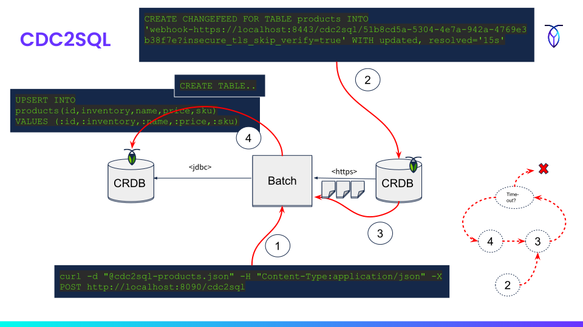

# Sample Commands

Collection of sample forms and cURL job commands.

## Prerequisites

- cURL
- A local CockroachDB v21.x+ cluster 
- Kafka for CDC kafka-sink examples (and CRDB enterprise licence)    

### Create databases

These samples use three different databases:

- pipeline - Database used by pipeline and Spring Batch for job execution
- tpcc - A sample source database to read from
- tpcc_copy - A sample target database to write to

Create these using:

````sql
cockroach sql --insecure --host=localhost -e "CREATE database pipeline"
cockroach sql --insecure --host=localhost -e "CREATE database tpcc"
cockroach sql --insecure --host=localhost -e "CREATE database tpcc_copy"
````

### Start server

    java -jar pipeline.jar --profiles crdb

# CDC2SQL

In this example, we UPSERT to a target table using a CDC webhook sink for a source table.



1. Submit job manifest to REST API
2. Create changefeed with webhook sink and use endpoint URI provided in step 1 response
3. Receive changefeed payload events via HTTPS
4. Optional DDL for target database
5. UPSERT of each payload batch read in step 3 into target database
6. Repeat `3->4` until read timeout (5 min default)

Ex:

    curl -X GET http://localhost:8090/cdc2sql/form?table=products > cdc2sql-products.json
    curl -d "@cdc2sql-products.json" -H "Content-Type:application/json" -X POST http://localhost:8090/cdc2sql

# Kafka2SQL

In this example, we UPSERT to a target table using a CDC Kafka sink for a source table.


1. Create changefeed with Kafka sink with use REST endpoint URI
2. Submit job manifest to REST API (step 1 and 2 in either order)
3. CockroachDB publishes CDC events to Kafka topic
4. Receive CDC events from Kafka topic and UPSERT of each batch read into target database
7. Repeat `3->4` until read timeout (5 min default)

Ex:

    curl -X GET http://localhost:8090/kafka2sql/form?table=products > kafka2sql-products.json
    curl -d "@kafka2sql-products.json" -H "Content-Type:application/json" -X POST http://localhost:8090/kafka2sql

# SQL2SQL

In this example, we created from a source table using pagination queries and write in batches to a 
target table in a other database.


1. Submit job manifest to REST API
2. Source database query based on manifest (keyset pagination)
3. Optional DDL for target database
4. UPSERT of each batch read in step 2 into target database 
5. Repeat `2->4` until no more rows 

Ex:

    curl -X GET http://localhost:8090/sql2sql/form?table=products > sql2sql-products.json
    curl -d "@sql2sql-products.json" -H "Content-Type:application/json" -X POST http://localhost:8090/sql2sql

# SQL2CSV

In this example, we IMPORT INTO a target table from a source table using a CSV stream. Its equivalent
to importing CSV files, only there are none but instead pipeline coverts the results of paginated
queries into a CSV stream.


1. Execute `IMPORT INTO` command and point out REST API endpoint with job manifest as parameter
2. Receive request from CockroachDB
3. Source database query based on manifest (keyset pagination)
4. Write query result to output stream in CSV format based on mapping in job manifest
5. Repeat `3->4` until no more rows

Ex:

    curl -X GET http://localhost:8090/sql2csv/form?table=products > sql2csv-products.json
    curl -d "@sql2csv-products.json" -H "Content-Type:application/json" -X POST http://localhost:8090/sql2csv

# Flat2SQL

In this example, we UPSERT to a target table from a CSV or flat-file source.


1. Submit job manifest to REST API
2. Read CSV from local file system or cloud storage bucket
3. Optional DDL for target database
4. UPSERT data read in step 2 into target database 
5. Repeat `2->4` until EOF

Ex:

    curl -X GET http://localhost:8090/flat2sql/form?table=products > flat2sql-products.json
    curl -d "@flat2sql-products.json" -H "Content-Type:application/json" -X POST http://localhost:8090/flat2sql

# Flat2CSV

In this example, we IMPORT to a target table using pipeline as proxy against a CSV or flat-file source.


1. Execute `IMPORT INTO` command and point out REST API endpoint with job manifest as parameter
2. Receive request from CockroachDB
3. Read fixed-width flat file from local file system or cloud storage bucket
4. Optional DDL for target database
5. Write query result to output stream in CSV format based on mapping in job manifest
6. Repeat `3->5` until no more rows

Ex:

    curl -X GET http://localhost:8090/flat2csv/form > flat2csv-products.json
    curl -X GET http://localhost:8090/templates/products-schema.json > products-schema.json
    curl -X GET http://localhost:8090/templates/products.txt > products.txt
    curl -d "@flat2csv-products.json" -H "Content-Type:application/json" -X POST http://localhost:8090/flat2csv

